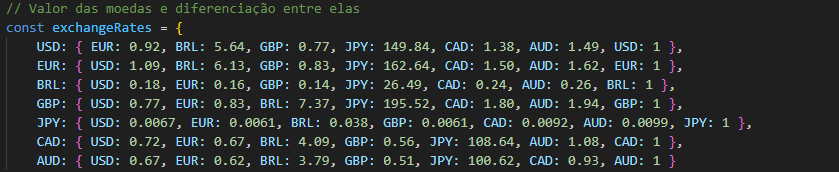
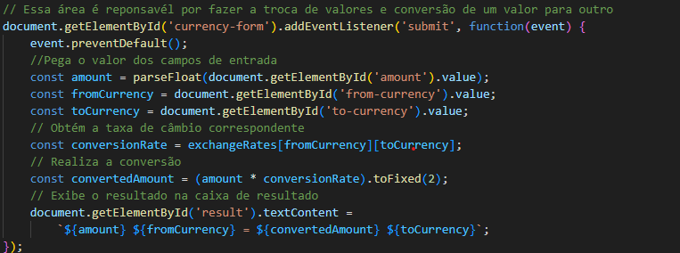
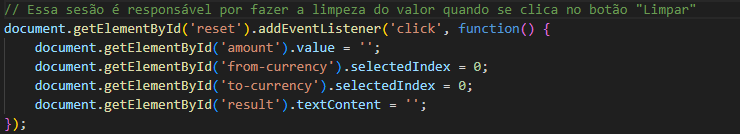
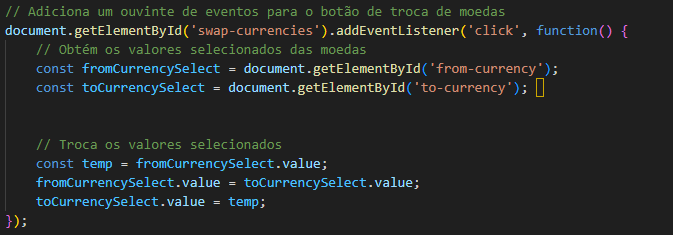

## Conversos de moedas
O projeto tem a função de treinar javaScript, fazendo um site que fará com que você digite um valor e ele ira dar algumas moedas para selecionar, em 2 diferentees espaços, e após clicar em "Converter" ele irá dizer a diferença de valor de uma para outra. Foi feito durante as aulas de Programação Web 1 sobre a supervisão do professor Leonardo Santiago Sidon da Rocha.

# Função
O projeto possui uma interface simples, porém funcional e intuitiva. No projeto é possível ver uma caixa aonde você pode digitar um valor númerico, ou apenas selecionar um com os botões ao lado. Mais abaixo á um caixa aonde você pode selecionar um tipo de moeda, e um pouco abaixo pode selecionar também as mesmas moedas. Abaixo dessas caixas possui 3 botões, um escrito "Trocar moedas" aonde caso você clique, ele inverte as moedas selecionadas, o botão "Apagar" que ira apagar o número digitado e por último o botão "Converter", que irá dizer a diferença de valores entre as duas moedas selecionadas.

## Valores/ Moedas

Aqui foi selecionado as moedas e a diferenciações que uma tem sobre a outra.

* const exchangeRates: É uma função que calcula a taxa de câmbio usadas e elimina o efeito ao calcular números de desempenho financeiro.
 
Fonte: https://www.investopedia.com/terms/c/constantcurrencies.asp#:~:text=Constant%20currencies%20are%20exchange%20rates,with%20optional%2C%20constant%20currency%20numbers.

## Conversão e conclusão

Aqui é utilizado uma sequência de "Const" e outros códigos que como resultado irão fazer a conversão de uma moeda da forma correta e esperada. E no final do código é possível ver uma parte que tem a função de realizar a ação da conversão e mostra lá.
* getElementById: Tem a função de pegar o valor de uma Id.
* Const: A declaração const cria uma variável cujo o valor é fixo, ou seja, uma constante somente leitura. Isso não significa que o valor é imutável, apenas que a variável constante não pode ser alterada ou retribuída. Nesse caso são utilizados diferentes "Const".
* addEventListener: Registra uma única espera de evento em um único alvo. O alvo do evento pode ser um único elemento em um documento, o documento em si, uma janela, ou um XMLHttpRequest.
 
Fonte:https://developer.mozilla.org/pt-BR/docs/Web/API/Document/getElementById

https://developer.mozilla.org/pt-BR/docs/Web/API/EventTarget/addEventListener

https://developer.mozilla.org/pt-BR/docs/Web/JavaScript/Reference/Statements/const

## Limpar formulário

Aqui é usado um código simples que de forma simplificada quando você clica no botão de "Limpar" ele reconhece que tem que limpar as caixas que foi comandado no código.

## Trocar valores.

Aqui é possível ver a parte do código para o botão de "Trocar moedas". E de forma simples esse código tem a função de quando clicar no botão, os dois valores serão invertidos.

## Consumo API

* "assync" é uma função que irá ser usada de forma combinada com o "await", que significa que ela irá suspender o método de chamada, e transferir o controle ao seu chamador, até que a tarefa esteja completa.

* Const URL: Foi utilizado uma  "const" para que se use o site "ViaCep" para que ele faça parte do processo de pegar um CEP e localizar. No site é mostrado um exemplo, porém foi alterado no projeto o local aonde o CEP de exemplo é posto para um "cep.value", aonde a pessoa que utilizar o site conseguirá digitar um CEP que a própria queira, e fazer com que ela funcione de acordo com o CEP digitado.

* Await: como citado antes, o "await" é um código que se usa da propriedade "assync", e nesse ponto ela estaria fazendo sua função antes citada.

* hasOwnProperty: é uma propriedade que irá retornar o bolleano indicado para ver ser a propriedade é definida no próprio objeto. Se não for o caso, ela irá retornar um Else falso.

* addEventListener: Ele irá registrar uma única espera de evento em um único alvo. Nesse caso fazendo com que assim que o usuário do site saia da caixa de adicionar CEP, o processo aonde ele valida o próprio e caso seja correto mostre as informações, e caso de errado, irá informar que o CEP é inválido.

## Fontes
https://developer.mozilla.org/pt-BR/docs/Web/JavaScript/Reference/Global_Objects/Object/hasOwnProperty
https://developer.mozilla.org/pt-BR/docs/Learn/JavaScript/Asynchronous/Introducing
https://developer.mozilla.org/pt-BR/docs/Web/API/EventTarget/addEventListener

## Tecnologias utilizadas 

* ``HTML 5``
* ``CSS 3``
* ``Java Script``
* ``Github``
* ``VsCode``
* ``Microsoft Teams``
* ``Google``
## Autor
Kleyverson de Oliveira Sampaio